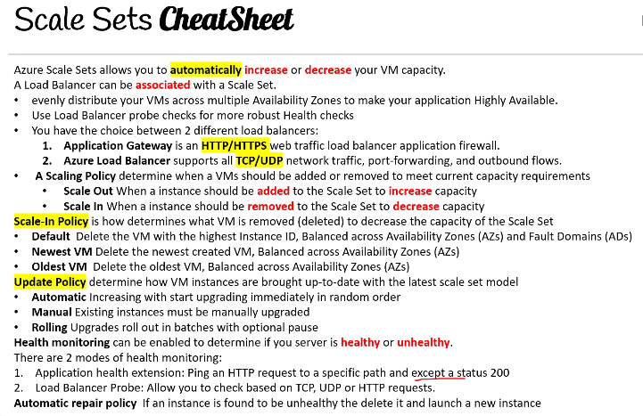
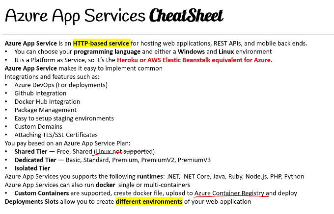
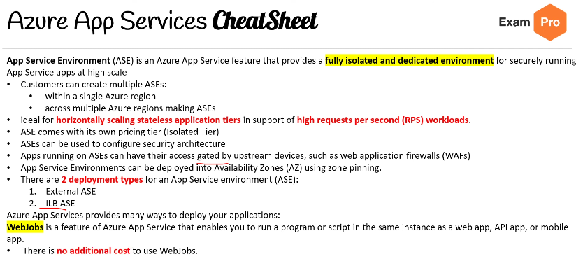
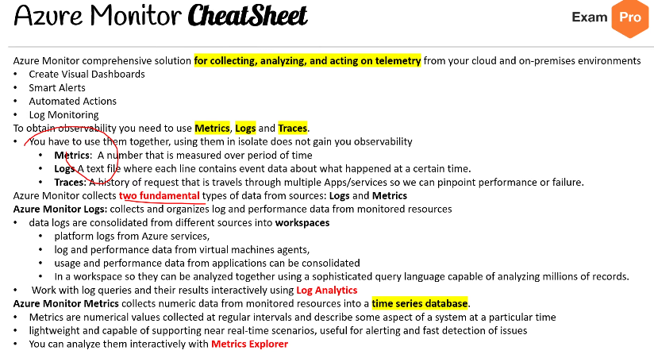
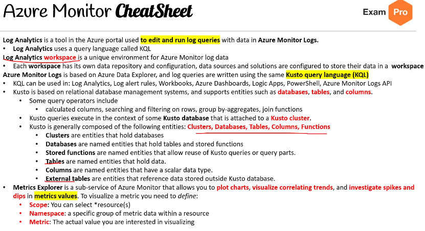
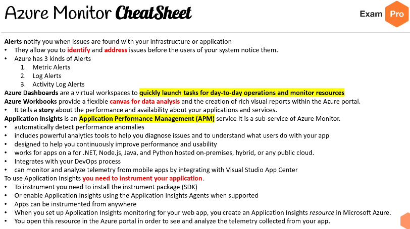

# AZ-104 Azure Administrator Associate #
## Microsoft Entra ##

**Active Directory (AD)** es el servicio de **gestión de identidad y acceso** de Microsoft. Ayuda a los empleados a iniciar sesión y acceder a recursos.

**Azure Active Directory (Azure AD)** es la versión en la nube de AD de Microsoft, como un servicio de identidad (**Identity as a Service - IDaaS**).

## Ediciones de Azure Active Directory:
1. **Free**: MFA gratuito, SSO, seguridad básica y registro de usuarios, gestión de usuarios.
2. **Office 365 Apps**: Protección de datos empresariales, SLA, sincronización entre nube y local.
3. **Premium 1 (P1)**: Arquitectura híbrida, grupos dinámicos, **Acceso condicional**.
4. **Premium 2 (P2)**: Protección de identidad (P2), gobierno de identidad.

Azure AD puede **autorizar** y **autenticar** múltiples fuentes:

- A tu AD local usando **Azure AD Connect**
- A tu aplicación web vía **App Registrations**
- Permitir a los usuarios iniciar sesión con su proveedor de identidad, ej. Facebook o Google, vía **External Identities**
- A Office 365 o **Microsoft Azure**

## Terminología de Active Directory:

- **Domain**: Un dominio es un área de una red organizada por una única base de datos de autenticación.
- **Active Directory Domain**: Es una **agrupación lógica** de objetos de AD en una red.
- **Domain Controller (DC)**: Un controlador de dominio es un servidor que **autentica** identidades de usuario y **autoriza** su acceso a recursos.
- **Domain Computer**: Un equipo registrado con una base central de autenticación. Sería un objeto de AD.
- **AD Object**: Es el elemento básico de Active Directory, como: usuarios, grupos, impresoras, equipos, carpetas compartidas.
- **Group Policy Object (GPO)**: Objeto virtual con configuraciones de políticas. Controla qué objetos de AD tienen acceso a qué recursos.
- **Organizational Units (OU)**: Subdivisión dentro del AD para agrupar usuarios, grupos, equipos y otras unidades.
- **Directory Service**: Servicio como **Active Directory Domain Services (AD DS)** que almacena datos de directorio y los hace disponibles a usuarios y administradores. Este servicio se ejecuta en un Domain Controller.

## Azure Active Directory - Tenants, Services y Usuarios

Un **tenant** representa una **organización** en Azure Active Directory. Un tenant es una instancia dedicada del servicio de Azure AD. Se crea automáticamente cuando te registras en alguno de los siguientes servicios:
- Microsoft Azure
- Microsoft Intune
- Microsoft 365

Cada Azure AD tenant es distinto y separado de otros Azure AD tenants.

Cuando se realiza una migración completa de AD a Azure, **no todas las funciones de AD están soportadas**, y en ese caso se necesita usar **Azure Active Directory Domain Services (AD DS)**, que proporciona **servicios de dominio gestionados**, como:

- Unión a dominio (Domain joins)
- Políticas de grupo (Group policies)
- Protocolo de acceso a directorios ligero (LDAP)
- Autenticación Kerberos / NTLM

## Funcionalidades de Azure AD Connect:

- **Password hash synchronization**: Método de inicio de sesión que sincroniza un hash de la contraseña del AD local con Azure AD.
- **Pass-through authentication**: Método de inicio de sesión que permite usar la misma contraseña local y en la nube.
- **Federation integration**: Entorno híbrido con infraestructura de AD FS local, para renovación de certificados.
- **Synchronization**: Crea usuarios, grupos y otros objetos, asegurando coincidencias entre datos locales y en la nube.
- **Health Monitoring**: Monitoreo robusto con una ubicación central en el portal de Azure para ver esta actividad.

## Usuarios

Los usuarios representan una **identidad para una persona o empleado** en tu dominio. Un usuario tiene credenciales de inicio de sesión que puede usar para acceder al portal de Azure.

### Tipos de usuarios en Azure AD:

- **Users**: Usuarios que pertenecen a tu organización.
- **Guest Users**: Usuarios invitados que pertenecen a otra organización.

---

## Grupos

Los grupos permiten al propietario del recurso (o propietario del directorio de Azure AD) asignar un conjunto de permisos de acceso a todos los miembros del grupo, sin tener que hacerlo individualmente.

### Los grupos contienen:

- **Owners**: Tienen permisos para agregar y eliminar miembros.
- **Members**: Tienen permisos para realizar acciones.

## Asignación (Assignment)

- Puedes asignar roles directamente a un grupo.
- Puedes asignar aplicaciones directamente a un grupo.

## Request to Join Groups

El propietario del grupo puede permitir que los usuarios encuentren sus propios grupos para unirse, en lugar de asignarlos manualmente. También puede configurar el grupo para aceptar automáticamente a todos los usuarios que se unan o requerir aprobación.

### Hay **cuatro formas de asignar derechos de acceso a recursos** a los usuarios:

- **Direct assignment**: El propietario del recurso asigna directamente el usuario al recurso.
- **Group assignment**: El propietario del recurso asigna un grupo de Azure AD al recurso, lo que automáticamente otorga acceso a todos los miembros del grupo.
- **Rule-based assignment**: El propietario del recurso crea un grupo y usa una regla para definir qué usuarios están asignados a un recurso específico.
- **External authority assignment**: El acceso proviene de una fuente externa, como un directorio local o una aplicación SaaS.

## Device Management Cheat Sheet

**Device Management** permite a las organizaciones administrar laptops, desktops y teléfonos que necesitan acceso a recursos en la nube.

La gestión de dispositivos se encuentra bajo **Azure Active Directory (Azure AD)**.

### Hay 3 formas de registrar (unir) dispositivos a Device Management:

#### 1. Azure Registered
- Dispositivos o móviles **propiedad personal**
- Inician sesión con una cuenta local o personal
- Compatibilidad con Windows 10, iOS, Android y MacOS

#### 2. Azure AD Joined
- Dispositivos **propiedad de la organización**
- Inician sesión con una cuenta organizacional
- Acceso solo a dispositivos que existen **en la nube** (**Cloud Native**)
  - Windows 10, Windows Server 2019

#### 3. Hybrid Azure AD Joined
- Dispositivos **propiedad de la organización**
- Inician sesión con cuenta de servicios de dominio de Active Directory propiedad de la organización
- Acceso a dispositivos que existen en la nube o **en local** (**on-premise**)
  - Windows 7, 8.1, 10, Windows Server 2008 o posterior

---

## Mobile Device Management (MDM)
- Control total del dispositivo, permite borrar datos y restaurarlo a estado de fábrica.

## Mobile Application Management (MAM)
- Publicar, enviar, configurar, asegurar, monitorear y actualizar apps móviles para tus usuarios.

## Azure Roles Cheat Sheet

Dentro de Azure existen **3 tipos de roles**:

1. **Classic subscription administrator roles**: El sistema de roles original.
2. **Azure roles**: Conocidos como Role-Based Access Controls (RBAC), construidos sobre Azure Resource Manager.
3. **Azure Active Directory (Azure AD) roles**: Se usan para administrar recursos de Azure AD en un directorio.

## Identity Access Management (IAM)
Permite crear y asignar roles Azure (RBAC) a los usuarios.

---

## Tipos de roles

Los roles restringen el acceso a acciones sobre recursos (también llamadas operaciones). Existen **2 tipos de roles**:

1. **BuiltInRole**: Roles administrados por Microsoft; solo puedes usar los que ya existen.
2. **CustomRole**: Rol creado por ti mismo con tu propia lógica personalizada.

### Role Assignment
Se refiere al momento en que se aplica un rol a un usuario. Un role assignment está compuesto por:
- Security Principal
- Role Definition
- Scope

Azure proporciona **4 roles incorporados**:
- Owner
- Contributor
- Reader
- User Access Administrator

---

## Classic Administrators (3 tipos):

1. **Account Administrator**: Propietario de la suscripción, responsable de facturación. No tiene acceso al portal de Azure.
2. **Service Administrator**: Tiene acceso completo al portal de Azure y es asignado como Owner a nivel de suscripción.
3. **Co-Administrator**: Tiene el mismo acceso que el Owner en el nivel de suscripción.

---

## Roles importantes en Azure AD

- **Global Administrator**: Acceso total a todo.
- **User Administrator**: Acceso completo para crear y gestionar usuarios.
- **Billing Administrator**: Puede hacer compras, administrar suscripciones y tickets de soporte.

> Puedes crear roles personalizados en Azure AD, pero necesitas adquirir: **Azure AD Premium P1 o P2**.

# Azure Resource Manager CheatSheet

**Azure Resource Manager (ARM)** es un servicio que permite **gestionar** recursos de Azure.

Es una capa de gestión que permite:
- Crear, actualizar y eliminar recursos
- Aplicar características de gestión como: control de acceso, locks, tags
- Escribir infraestructura como código (IaC) mediante plantillas JSON

---

## Características clave

- ARM es una capa de servicio que **abarca múltiples características y servicios**, como:
  - Subscriptions
  - Management Groups
  - Resource Groups
  - Resource Providers
  - Resource Locks
  - Azure Blueprints
  - Resource Tags
  - Access Control (IAM)
  - Role-Based Access Controls (RBAC)
  - Azure Policies
  - ARM Templates

- ARM funciona como un **gatekeeper**:
  - Todas las solicitudes pasan por ARM y este decide si se permite realizar la acción solicitada sobre un recurso.

---

## Scope

- Es una **boundary of control** para los recursos de Azure.
- Permite **gobernar** los recursos al organizarlos lógicamente y aplicar reglas.
- **Niveles jerárquicos de alcance**:
  - **Management Groups**: Agrupación lógica de múltiples suscripciones
    - **Subscriptions**: Acceso a servicios de Azure con base en facturación
      - **Resource Groups**: Agrupación lógica de recursos
        - **Resources**: Recursos individuales como máquinas virtuales

---

## Otros conceptos importantes

- Una cuenta de Azure puede tener **múltiples suscripciones** (por ejemplo: Free Trial, Pay-As-You-Go, Azure for Students)

- **Resource Providers**: Lista de servicios posibles dentro de Azure. Algunos se registran automáticamente, otros requieren registro manual.

- **Resource Tags**: Son **pares clave-valor** que se asignan a recursos de Azure para clasificarlos y organizarlos.

- **Resource Locks**:
  - Previenen modificaciones o eliminaciones accidentales.
  - Tipos:
    - **CanNotDelete (Delete)**: Se puede leer y modificar, pero no eliminar el recurso.
    - **ReadOnly (Read-only)**: Solo lectura, no se puede modificar ni eliminar.

- **Blueprints**:
  - Habilitan la **creación rápida de suscripciones gobernadas**
  - Lo que defines en un blueprint (qué **debe ser** desplegado) se compara con lo que realmente fue desplegado (**qué fue** desplegado).

---

> Azure Blueprints y ARM Templates pueden trabajar juntos para estandarizar la gobernanza y despliegue de recursos en Azure.
##  ARM Templates CheatSheet

## Infraestructura como Código (IaC)
**IaC** es el proceso de **gestionar y aprovisionar** centros de datos mediante archivos de definición legibles por máquina (como archivos JSON), en lugar de configurar hardware o herramientas interactivas manualmente.

### Tipos de IaC:
- **Declarative**: Defines exactamente lo que deseas, y obtienes eso.
- **Imperative**: Defines lo que deseas en general, y el servicio intenta adivinar lo que necesitas.

---

## ARM Templates

- Son **archivos JSON que definen recursos de Azure** que deseas aprovisionar y servicios que deseas configurar.
- Son **declarativos**: obtienes exactamente lo que defines.

---

## Estructura de un template ARM

Un template ARM contiene la siguiente estructura JSON:

- **$schema**: Describe las propiedades disponibles dentro de la plantilla.
- **contentVersion**: Versión del template. Puedes asignar cualquier valor.
- **apiProfile**: Permite evitar especificar versiones de API para cada recurso.
- **parameters**: Valores que puedes pasar al template.
- **variables**: Transforman parámetros o definen valores intermedios.
- **functions**: Funciones definidas por el usuario, disponibles dentro del template.
- **resources**: Recursos que deseas desplegar o actualizar.
  - `type`: Tipo de recurso
  - `apiVersion`: Versión de API REST para ese recurso
  - `name`: Nombre del recurso
  - `location`: Región donde se desplegará
  - `other properties`: Propiedades adicionales específicas del tipo de recurso
- **outputs**: Valores que se retornan luego del despliegue.

---

> ARM Templates son esenciales para despliegues consistentes, repetibles y automatizados en entornos Azure.

# Storage Accounts CheatSheet

## Azure tiene 5 tipos de servicios de almacenamiento:

1. **Azure Blob**  
   - Almacenamiento tipo **object store** para texto y datos binarios.
   - Escalable masivamente.
   - Compatible con Data Lake Storage Gen2 para big data analytics.

2. **Azure Files**  
   - **File shares** gestionados para implementaciones en la nube o locales.

3. **Azure Queues**  
   - **NoSQL store** para almacenamiento esquemático de datos estructurados.

4. **Azure Tables**  
   - **Messaging store** confiable entre componentes de aplicaciones.

5. **Azure Disks**  
   - Volúmenes de almacenamiento de nivel de bloque (**Block-level storage**) para VMs de Azure.

---

## Tipos de rendimiento en cuentas de almacenamiento:

- **Standard**: Almacenado en discos duros (**HDDs**).
- **Premium**: Almacenado en unidades de estado sólido (**SSDs**).
  - Desempeño varía por nivel de acceso: Hot, Cool, Archive.

---

## Azure Blob Storage admite 3 tipos de blobs:

1. **Block blobs**:  
   - Almacenan texto y datos binarios.
   - Divididos en bloques.
   - Soportan hasta ~4.75 TiB.

2. **Append blobs**:  
   - Optimizado para operaciones de anexado (append).
   - Útil para logs de VMs, etc.

3. **Page blobs**:  
   - Almacenan archivos aleatorios (hasta 8 TiB).
   - Usados como discos virtuales (VHD) para VMs.

---

## Tipos de acceso en Blob Storage (para **Standard**):

- **Hot**:  
  - Acceso frecuente.
  - Mayor costo de almacenamiento, menor costo de acceso.

- **Cool**:  
  - Acceso infrecuente (≥30 días).
  - Menor costo de almacenamiento, mayor costo de acceso.

- **Archive**:  
  - Acceso muy infrecuente (≥180 días).
  - Costo más bajo de almacenamiento, mayor costo de acceso.

---

## Tiering de almacenamiento:

- **Account-Level Tiering**:  
  - Si un blob no tiene un tier definido, hereda el de la cuenta de almacenamiento.

- **Blob-Level Tiering**:  
  - Puedes elegir el tier por blob.
  - Cambiar de tier es instantáneo excepto al salir de "archive", que puede tardar horas.

> Esto se conoce como **rehydrating** un blob.

# Storage Accounts CheatSheet (Parte 2)

## Blob Lifecycle Management
Puedes crear políticas basadas en reglas para mover datos entre niveles de almacenamiento (tiers).  
Ejemplo: Después de 30 días, mover a "cool storage".

- Cuando un blob es cargado o movido de tier, **se cobra inmediatamente** según la nueva tarifa.

---

### Al mover desde un tier **más frío**:
- Se cobra como una **write operation** hacia el tier de destino.
- Se aplican cargos de operación de escritura (por cada 10,000) y cargos por GB escritos en el tier de destino.

### Al mover desde un tier **más caliente**:
- Se cobra como una **read operation** desde el tier de origen.
- Se aplican cargos de lectura (por cada 10,000) y recuperación de datos (por GB) del tier de origen.
- También pueden aplicarse cargos por eliminación anticipada si el blob se movió fuera del tier "cool" o "archive" antes de tiempo.

---

## Eliminación anticipada en cool/archive:
- Blobs en tier **cool** (solo cuentas GPv2) tienen un periodo de retención mínimo de 30 días.
- Blobs en tier **archive** tienen un periodo mínimo de retención de **180 días** (cobro prorrateado si se eliminan antes).

---

## Múltiples formas de mover datos a Azure Blob Storage:

- **AzCopy**:  
  Herramienta de línea de comandos para Windows y Linux.

- **Azure Storage Data Movement library**:  
  Librería .NET que usa AzCopy internamente.

- **Azure Data Factory**:  
  Servicio ETL de Azure.

- **Blobfuse**:  
  Acceso al sistema de archivos virtual desde Linux.

- **Azure Data Box**:  
  Dispositivo físico para transportar grandes volúmenes de datos a Azure.

- **Azure Import/Export service**:  
  Servicio para enviar discos físicos para carga de datos en Azure.

# Storage Accounts CheatSheet (Replication Types)

Cuando creas una cuenta de almacenamiento en Azure, debes elegir un **Replication Type**  
(Importante para recuperación ante desastres y tolerancia a fallos).

---

## Primary Region Redundancy  
**(Recuperación ante desastres y fallos dentro de una misma región)**

- **Locally Redundant Storage (LRS)**  
  - Copia los datos **sincrónicamente** dentro de una única región.  
  - 💰 **Opción más barata**

- **Zone-Redundant Storage (ZRS)**  
  - Copia los datos **sincrónicamente** entre **3 Zonas de Disponibilidad (AZs)** dentro de una región.

---

## Secondary Region Redundancy  
**(Recuperación ante desastres entre regiones)**

- **Geo-Redundant Storage (GRS)**  
  - Copia los datos **sincrónicamente** en la región primaria.  
  - Copia los datos **asincrónicamente** a una región secundaria.

- **Geo-Zone-Redundant Storage (GZRS)**  
  - Copia los datos **sincrónicamente** entre **3 AZs** en una región primaria.  
  - Copia los datos **asincrónicamente** a una región secundaria.

---

## Secondary Region Redundancy with Read Access  
**(Replica con acceso de solo lectura a la región secundaria)**

- **Read-Access Geo-Redundant Storage (RA-GRS)**  
  - Copia los datos **sincrónicamente** en la región primaria.  
  - Copia los datos **asincrónicamente** en la región secundaria.  
  - ✅ Permite **lectura** desde la réplica.

- **Read-Access Geo-Zone-Redundant Storage (RA-GZRS)**  
  - Copia los datos **sincrónicamente** entre AZs de la región primaria.  
  - Copia los datos **asincrónicamente** en la región secundaria.  
  - ✅ Permite **lectura** desde la réplica.

---

> 🔁 **Síncrono** = los datos se replican inmediatamente.  
> 🕒 **Asíncrono** = puede haber un pequeño retraso en la replicación (útil en desastres mayores).

# Storage Accounts CheatSheet – Azure Files

**Azure Files** es un recurso de almacenamiento totalmente gestionado en la nube que actúa como un **servidor centralizado** para compartir archivos y permite **múltiples conexiones**.

---

## 🔗 Conexión (Mounting)

- Usa protocolos de red como **SMB** (Server Message Block) y **NFS** (Network File System).
- Al montarse, el sistema de archivos compartido se muestra como parte del árbol de directorios local.

---

## 📦 Copias de seguridad y Snapshots

- Puedes hacer backup de tus archivos usando **shared snapshots**.
- Snapshots de solo lectura, incrementales, hasta **200 por recurso compartido**.
- Se pueden conservar **hasta 10 años**.
- Usa **Soft Delete** para evitar eliminaciones accidentales (retención temporal antes del borrado final).

---

## 🧊 Niveles de Almacenamiento (Store Tiers)

- **Premium**: Almacenado en SSD, baja latencia para operaciones de entrada/salida.
- **Transaction Optimized**: Almacenado en HDD, optimizado para cargas de trabajo con muchas transacciones.
- **Hot**: Uso general, ideal para compartir archivos como **Azure File Sync** o entre equipos.
- **Cool**: Almacenado en HDD, diseñado para almacenamiento en frío de bajo costo.

---

## 💽 Tipos de almacenamiento

- **General Purpose v2 (GPv2)** – Desplegado en HDD.
- **FileStorage** – Desplegado en SSD (necesario para archivos Premium).

---

## 🔐 Identidad y Acceso

- Compatible con identidad **on-premises** (mediante AD DS) o **Storage Account Key**.
- Accesible desde cualquier red usando un **public endpoint**.

---

## 🌐 Acceso en red

- El protocolo **SMB** usa el **puerto 445**.
- Puede ser necesario **desbloquear este puerto** para montar el recurso compartido.

---

## 🔐 Encriptación

- **Encrypted-at-rest**: Protección en reposo con **Azure Storage Service Encryption (SSE)**.
- **Encrypted-in-transit**: Cifrado SMB 3.0+ o HTTPS.

---

## 🔁 Azure File Sync

Servicio que permite **cachear** archivos de Azure en un **servidor Windows local** o una **máquina virtual en la nube**.

---

# Storage Accounts CheatSheet – Azure Import/Export Service

El servicio **Azure Import/Export** se usa para importar o exportar grandes volúmenes de datos hacia/desde **Azure Blob Storage** y **Azure Files** de forma segura.

---

## 📦 Opciones de importación

Tienes **2 opciones** para el envío de discos al importar:

1. Usar tus propios discos.
2. Usar discos proporcionados por **Microsoft**:
   - Microsoft puede enviar hasta **5 discos SSD cifrados** (llamados **Azure Data Box Disk**) con una capacidad total de **40 TB** por orden.
   - Envío a través de un **carrier regional** hacia el datacenter.

---

## ⚙️ Preparación del disco

Para preparar el disco, necesitas usar la herramienta de línea de comandos: **WAImportExport tool**:

- Preparar los discos que se enviarán.
- Copiar tus datos al disco.
- Cifrar el disco con **AES 256-bit** usando **BitLocker**.
- Generar archivos de diario (journal) usados durante la creación del trabajo.
- Ayuda a identificar el número de discos requeridos.

---

## 🔢 Versiones del WAImportExport

- **Versión 1**: Para importar/exportar datos a Azure Blob Storage.
- **Versión 2**: Para importar datos hacia Azure Files.

> 🪟 **WAImportExport tool** es **compatible solo con Windows de 64 bits**

---

## 🚚 Exportación

Para trabajos de **exportación**:

- Solo puedes exportar desde **Azure Blob**.
- Puedes enviar hasta **10 discos** a Azure por trabajo.
- Creas un **archivo de exportación** y los datos se cargan en los discos y se te devuelven.

---
# Storage Accounts CheatSheet – Shared Access Signatures (SAS)

Una **SAS (Shared Access Signature)** es una URI que otorga derechos de acceso restringido a recursos de **Azure Storage**.

Se comparte la URI para permitir acceso temporal con un conjunto específico de permisos.

---

## 🧾 Tipos de SAS

### 🔐 Account-level SAS
- Acceso a recursos en **uno o más servicios** de almacenamiento.

### 🗝️ Service-level SAS
- Acceso a una **cuenta de almacenamiento individual** usando la **clave de cuenta**.

### 👤 User Delegation SAS
- Acceso usando credenciales de **Azure AD**.
- Limitado a **Blob y Contenedores**.
- **Método recomendado** por Microsoft para acceder vía SAS.

---

## 📦 Formatos de SAS

### 🕓 Ad hoc SAS
- La **hora de inicio, expiración y permisos** están incluidos en la URI.
- Cualquier tipo de SAS puede ser creado como SAS ad hoc.

### 📑 Service SAS con stored access policy
- La **stored access policy** se define sobre un recurso (limitado a blob container, table, queue o file share).
- Una **misma stored access policy** puede usarse en múltiples SAS para facilitar la gestión de restricciones.

---
# Virtual Machines CheatSheet

**Azure Virtual Machines (VMs)** te permite crear máquinas virtuales Linux y Windows en la nube.

## 🖼️ Tamaño de la VM
- El tamaño se define por la **imagen**, que combina:
  - vCPUs
  - Memoria
  - Capacidad de almacenamiento

- 🔢 **Límite por suscripción**: 20 VMs por región  
- 💰 **Facturación por hora**  
- ✅ Una sola instancia tiene una disponibilidad del **99.9%** (cuando todos los discos son premium)  
- 🛡️ Dos instancias en un **Availability Set** → 99.95% de disponibilidad

## 🗃️ Discos y Red
- Puedes adjuntar múltiples **Managed Disks** a tus VMs
- Al **lanzar** una VM, se crean/asignan componentes de red como:
  - NSG (Network Security Group)
  - NIC (Network Interface)
  - IP Pública
  - VNet

## 🐧 Bring Your Own Linux
- Puedes crear una VM Linux usando tu propio **Linux VHD (Virtual Hard Disk)**

## 📏 Tamaños de VM (SKU) optimizados para:
- General Purpose
- Compute Optimized
- Memory Optimized
- Storage Optimized
- GPU
- High Performance Compute

## 💡 Azure Compute Unit (ACU)
- Comparación de rendimiento de CPU entre SKUs
- Referencia: **Small (Standard_A1)** tiene un ACU de **100**
- Otros SKUs indican cuántas veces más rápido son respecto al estándar

## 📱 Administración
- Puedes usar la **Azure Mobile App** para monitorear tus VMs

## ⚙️ Hyper-V
- Producto de virtualización de hardware de Microsoft
- Permite **crear y ejecutar una versión virtual de una computadora**
- Dos generaciones:
  - **Generación 1**: soporta la mayoría de sistemas operativos
  - **Generación 2**: soporta 64-bit y sistemas más recientes (Linux, FreeBSD)
- Las VMs de Hyper-V usan discos virtuales: **VHD o VHDX**

## 🔌 Formas de Conectarse a una Virtual Machine en Azure

Hay **3 formas de conectarte** a tus Virtual Machines:

---

### 1. **SSH (Secure Shell)**
- Conexión mediante terminal o cliente SSH (por ejemplo, **PuTTY**)
- 🛡️ Usa el puerto **22 TCP**
- Se pueden usar pares de claves RSA para autorizar el acceso

---

### 2. **RDP (Remote Desktop Protocol)**
- Interfaz gráfica para conectarse a otra computadora a través de la red
- Permite conexión remota a servidores **Windows**
- 🛡️ Usa el puerto **3389 TCP y UDP**

---

### 3. **Azure Bastion**
- Servicio que te permite conectarte a una VM desde tu navegador y el portal de Azure
- Compatible tanto con **SSH** como con **RDP**
- Ideal si usas un navegador sin permisos para instalar software (ej. Chromebook)

---

## 🔄 Update Management

Permite **gestionar e instalar actualizaciones y parches** del sistema operativo en:
- Máquinas virtuales **Windows**
- Máquinas virtuales **Linux**
- Aplica tanto a recursos en Azure como en otros proveedores

**Funciones clave:**
- Realiza escaneo de cumplimiento de actualizaciones
- 🕓 Escaneo por defecto:
  - **Cada 12 horas en Windows**
  - **Cada 3 horas en Linux**
- Puede tomar entre **30 minutos y 6 horas** para reflejar los datos actualizados en el dashboard

# 💽 Azure Disks CheatSheet

## Azure Managed Disks

- Son **volúmenes de almacenamiento a nivel de bloque** gestionados por Azure y usados con máquinas virtuales (VMs).
- Ofrecen **99.999% de disponibilidad**.
- Azure crea **3 réplicas** de tus datos para alta durabilidad.
- Puedes crear hasta **50,000 discos VHD por tipo** en una región.
- Hasta **1,000 VMs** pueden usar discos gestionados con una imagen de Marketplace.
- Se integran con **Availability Sets** y **Availability Zones**.

---

## 🔐 Seguridad y Accesos

- Puedes usar **Azure Role-Based Access Control (RBAC)** para asignar permisos sobre discos gestionados.
- Puedes importar directamente tus discos VHD a Azure Managed Disks.
- Puedes usar **Azure Private Links** para que el tráfico entre Discos y VMs no salga de la red de Microsoft.

---

## 🔁 Azure Backup

- Se puede usar para crear copias de seguridad con políticas de retención basadas en tiempo.

---

## 🔒 Cifrado (Encryption)

### Tipos de cifrado:

1. **Server Side Encryption (SSE)** – activado por defecto:
   - Aplica a discos, snapshots e imágenes.
   - Los discos temporales **no se cifran**, a menos que habilites el cifrado en el host.

2. **Tipos de claves**:
   - **Platform-managed keys** – Azure maneja las claves.
   - **Customer-managed keys** – Tú gestionas las claves.

### Otras herramientas:
- **Azure Disk Encryption (ADE)**: permite cifrar los discos del sistema operativo y de datos en VMs IaaS.
  - En Windows usa **BitLocker**.
  - En Linux usa **DM-Crypt**.

# 💽 Azure Disks CheatSheet (Disk Roles)

En Azure existen **3 tipos de roles de disco**:

---

## 📦 Data Disk
- Disco gestionado adjunto a una VM para almacenar datos de aplicaciones u otros datos persistentes.
- Registrado como unidad SCSI y se puede etiquetar como desees.
- Tiene un límite de hasta **32,767 GiB**.
- El número y tipo de discos que puedes añadir depende del tamaño de la VM.

---

## ⚙️ OS Disk
- Cada máquina virtual tiene un **disco de sistema operativo**.
- Este disco contiene el SO que se seleccionó al crear la VM.
- También contiene la **partición de arranque** (boot volume).
- Tiene un límite de hasta **4,095 GiB**.

---

## ⚠️ Temporary Disk
- La mayoría de VMs tienen un **disco temporal** (no gestionado).
- Usado para **almacenamiento temporal de procesos y datos** como archivos de paginación o swap.
- Los datos en el disco temporal pueden perderse en eventos de mantenimiento o al reaprovisionar la VM.
- En un reinicio estándar, los datos persisten.
- Ruta del disco temporal:
  - Linux: `/dev/sdb`
  - Windows: `D:` (por defecto)
- **No está cifrado** con SSE a menos que habilites cifrado en host.

---

## 🧷 Managed Disk Snapshot

- Es una **copia completa de solo lectura y crash-consistent** de un disco gestionado.
- Guardado como un disco gestionado estándar por defecto.
- **Snapshots**:
  - Son de tipo **punto en el tiempo**.
  - Existen independientemente del disco original y pueden usarse para crear discos nuevos.
  - Se facturan con base en el tamaño real usado.
    - Ejemplo: si tu disco tiene 64 GB pero usas solo 10 GB, se facturan solo los 10 GB.
  - Puedes ver el tamaño usado desde el informe de uso de Azure.

# 💽 Azure Disks CheatSheet (Tiers y Custom Images)

## 📸 Managed Custom Image vs Snapshot

- Una **Managed Custom Image** crea una imagen (del disco de una VM) que contiene:
  - **Todos los discos gestionados** asociados a la VM (OS y Data Disks).
- Una **Snapshot**:
  - Es una captura de un único disco.
  - ❗ **No tiene conocimiento de los otros discos** que pueda haber en la VM.

Para replicar múltiples discos (por ejemplo, para striping), se recomienda usar una **Managed Custom Image**.

---

## 💠 Tiers de discos en Azure

Azure ofrece **4 niveles (tiers)** de discos gestionados:

### 1. 🔺 Ultra Disks
- Alto rendimiento y IOPS ultra altos, baja latencia.
- Rendimiento ajustable sin necesidad de reiniciar la VM.
- Ideal para cargas intensivas como SAP HANA, bases de datos de alto nivel y transacciones.
- Solo se pueden usar como **data disks** (no OS).
- Solo compatibles con **VM series específicas**.

---

### 2. 💎 Premium SSD
- Discos SSD de alto rendimiento y baja latencia.
- Para cargas críticas y aplicaciones con uso intensivo de E/S (IOPS).
- Solo disponibles en series de VM compatibles con almacenamiento premium.
- Garantizan IOPS y rendimiento para cada tamaño (los Standard no).
- Rendimiento constante el 99.9% del tiempo según la tabla de IOPS publicada.

---

### 3. 📦 Standard SSD
- Opción SSD de bajo costo optimizada para cargas con necesidad de rendimiento consistente pero menor IOPS.
- Mejor que HDDs estándar en disponibilidad, consistencia, confiabilidad y latencia.
- Ideal para:
  - Web servers
  - Aplicaciones empresariales de bajo uso
  - Entornos de desarrollo y prueba (Dev/Test)
- IOPS y rendimiento descritos en la tabla de Azure y se garantiza el 99% del tiempo.

---

### 4. 💽 Standard HDD
- Opción más económica, ideal para cargas sin requerimientos de latencia (archivos, logs).
- Disponible para **todas las VMs de Azure**.
- Latencia de escritura <10ms y lectura <20ms para la mayoría de operaciones.
- Mayor variabilidad en rendimiento en comparación con SSDs.

# 🌐 Azure Application Gateway CheatSheet

**Azure Application Gateway** es un servicio de **application-level routing** y **load balancing**.

- Opera en la **Capa 7 del modelo OSI (Application Layer)**.

---

## 🔒 Azure Web Application Firewall (WAF)
- Puedes asociar políticas WAF al Application Gateway para mejorar la seguridad.

---

## 🧩 Componentes principales del Application Gateway:

### 1. **Frontends**
- Aquí eliges el tipo de dirección IP:
  - 🔒 **Private IP** → crea un Load Balancer Interno.
  - 🌐 **Public IP** → crea un Load Balancer Público/Externo.

---

### 2. **Backends**
- Se crean grupos de backends (**Backend Pools**):
  - Un backend pool es una colección de recursos donde el Application Gateway puede enviar tráfico.
  - Puede incluir:
    - VMs
    - Conjuntos de escalado de VM
    - Direcciones IP
    - Nombres de dominio
    - App Services

---

### 3. **Routing Rules**
- Compuestas por: **Listeners**, **Backend targets**, y **HTTP Settings**.

#### 🎧 Listeners
- “Escuchan” en un puerto/IP específico para tráfico con un protocolo determinado.
- Si se cumplen los criterios, se aplican las reglas de enrutamiento.
- Tipos de listeners:
  - **Basic** → reenvía todas las peticiones a los backend pools.
  - **Multi-site** → reenvía peticiones a diferentes pools según el **host header y host name**.
    - Las peticiones se evalúan según el **orden de las reglas** y tipo de listener.
    - Se recomienda agregar los listeners más específicos primero.

---

#### 🎯 Backend targets
- Determinan hacia dónde va el tráfico:
  - **Backend Pool**
  - **Redirection**

---

## ⚙️ HTTP Settings
- Configuran cómo tratar las cookies, vaciado de conexiones (connection draining), límites de tamaño, entre otros.

